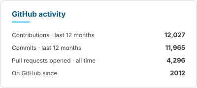
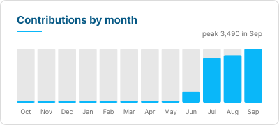

<h1 align="center">Zia Saidi</h1>

<strong>Software architect · 25+ years of shipped work</strong>

  I build your web application end to end — with an AI team trained on my own written
  standards, so you get full-team capability at the speed and cost of one senior engineer.

  <a href="https://zia.saidi.pro">zia.saidi.pro</a> ·
  <a href="https://zia.saidi.pro/request-for-proposal">Request a proposal</a> ·
  <a href="https://fantastical.app/zia/intro">Book a call</a> ·
  <a href="https://www.linkedin.com/in/ziasaidi/">LinkedIn</a>

---

## Work that moved the number

- **[ATM Gurus](https://zia.saidi.pro/projects/atm-gurus)** — a rebuilt parts-and-services
  storefront drove dramatic, sustained growth in monthly sales within six months, with no
  increase in advertising spend.
- **[Christian Brands](https://zia.saidi.pro/projects/christian-brands)** — two brand
  storefronts unified behind a legacy ERP, with **45,000+ products** migrated onto the new
  platform.
- **[BostonPads](https://zia.saidi.pro/projects/bostonpads)** — one listings engine,
  application management system, and custom middleware behind a **40+ site** branded
  property network.
- **[Openbay](https://zia.saidi.pro/projects/openbay)** — the microservices platform behind a
  B2C and B2B auto-repair marketplace; I proposed and built the partnership program,
  subscriptions, and partner-portal systems that opened new revenue lines.

<a href="https://zia.saidi.pro/projects">See all the work →</a>

## How I build

Every project runs on a managed AI team — planner, implementer, independent reviewer, asset
generator — each seat following my written engineering standards, and each filled by the
model family best suited to it, so reviews never share the author's blind spots. I sign off
on every delivery myself, and every correction I make gets written back into the standards.

- A written operating system: verification discipline, TDD by default, atomic commits,
  CI-gated pull requests
- 30+ authored skills encoding my standards across the whole product lifecycle
- Decision-complete plans up front, so ambiguity never stalls a build
- Persistent project memory and clean handoffs — no quality cliff on long projects
- Speed from parallelism, not corner-cutting

<a href="https://zia.saidi.pro/process">See how I build →</a>

## GitHub activity

  <picture>
    <source media="(prefers-color-scheme: dark)" srcset="assets/stats-dark.svg">
    
  </picture>
  <picture>
    <source media="(prefers-color-scheme: dark)" srcset="assets/activity-dark.svg">
    
  </picture>

These cards are generated by [a workflow in this repository](.github/workflows/profile-stats.yml)
and committed as static SVGs — no third-party service, no rate limits, and the job **fails
rather than publish a number it cannot verify**. The figures include private and client work,
which is most of what I ship; the public repositories here are a small slice of it.

## Stack

| | |
| --- | --- |
| **Languages** | TypeScript · JavaScript · PHP · Go · Python · Ruby · R |
| **Frontend** | Vue 3 · Vite · Pinia · SSR / SSG · Sass |
| **Backend** | NestJS · Node.js · Laravel · Ruby on Rails · FastAPI |
| **Data** | PostgreSQL · TypeORM · Oracle · TSQL |
| **Messaging** | NATS · RabbitMQ · ZeroMQ · Socket.io |
| **Infrastructure** | Docker · Terraform · Nomad · Consul · Vault · Kubernetes · GitHub Actions |
| **Quality** | Vitest · Playwright · TDD · CI-gated PRs |

## In the open

- **[dotfiles](https://github.com/ziazon/dotfiles)** — the shell and editor environment I
  actually work in.
- **[koga-discord-bot](https://github.com/ziazon/koga-discord-bot)** — a TypeScript Discord
  bot pulling game APIs for a gaming clan.

## Let's talk

Tell me about your project and I'll come back with a tailored proposal.

<a href="https://zia.saidi.pro/request-for-proposal">Request a Proposal</a> ·
<a href="https://fantastical.app/zia/intro">Book a call</a> ·
<a href="https://zia.saidi.pro/contact">Send me a message</a>
